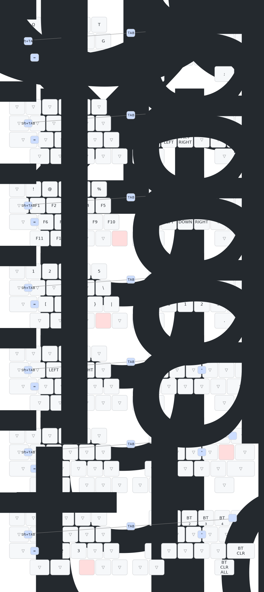

# SOA44 ZMK設定

## 機能

- 44キー分割レイアウト
- トラックボール搭載
- ニッケル水素電池対応（カスタム電圧管理）
- Bluetooth接続性能向上（+8dBm出力）
- zmk-rgbled-widgetによるRGB LEDレイヤー表示
- ZMK Studio対応

## RGB LED設定

この設定では[zmk-rgbled-widget](https://github.com/gohanda11/zmk-rgbled-widget)ドライバーを使用して、RGB LEDによる視覚的なステータス表示を実現しています。このウィジェットは3種類のインジケーターを提供します：

### レイヤー表示
- **色ベースのレイヤー表示**: 各レイヤーに固有の色を割り当て、そのレイヤーがアクティブな間、色が表示され続けます
- **レイヤー色の設定**: 
  - レイヤー 0 (Default): 黒 (0)
  - レイヤー 1 (Mouse): 赤 (1)
  - レイヤー 2 (Function): 緑 (2)
  - レイヤー 3 (Number): 黄 (3)
  - レイヤー 4 (Arrow): 青 (4)
  - レイヤー 5 (Scroll): マゼンタ (5)
  - レイヤー 6 (Bluetooth): シアン (6)

### ステータス表示
電源ON時のステータス表示：
- **バッテリーステータス**: バッテリーレベルの表示（緑/黄/赤）
- **接続ステータス**: Bluetooth接続状態（青=接続中、黄=アドバタイジング、赤=切断）

## キーマップ

